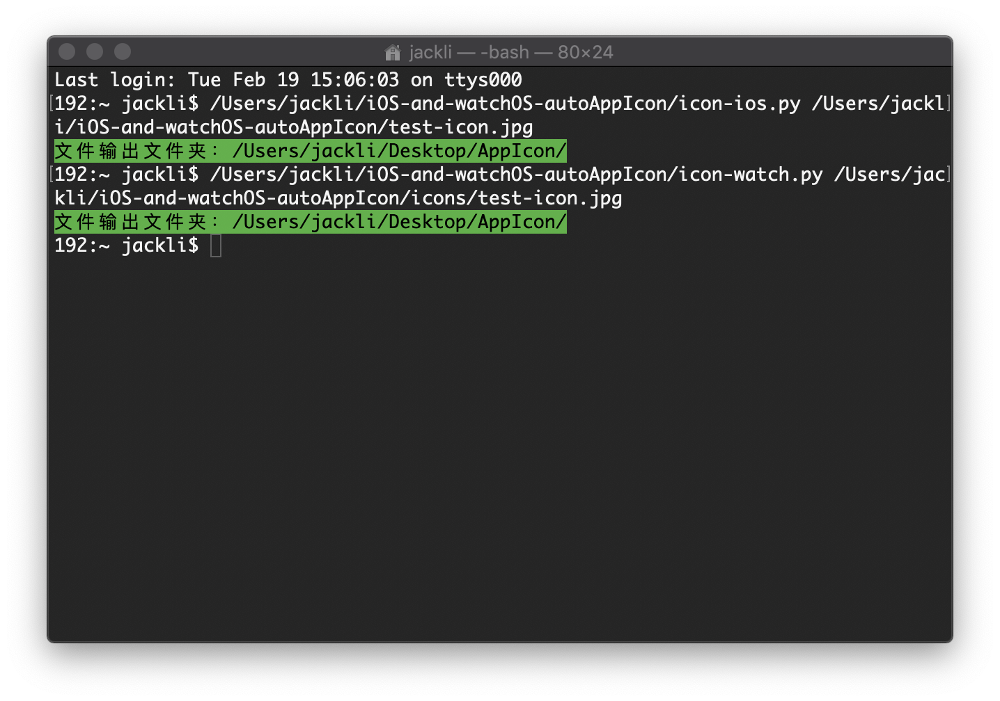
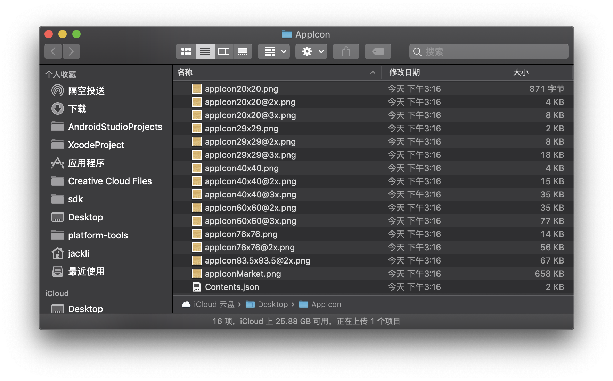
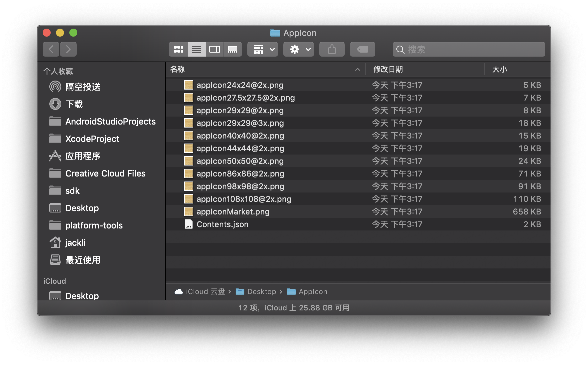

# iOS and watchOS autoAppIcon
Auto export iOS and watchOS App Icon. 自动生成iOS和watchOS应用图标表。

# License
Copyright © 2019 Jack Lee. All rights reserved.

Licensed under the MIT License.

# Dependencies
* [Auto Export AppIcon](https://github.com/mgfjxxiexiaolong/autoExportAppIcon)

# Usage
iOS icon

```
$ icon-ios.py <Picture.png>
```

watchOS icon

```
$ icon-watch.py <Picture.png>
```

# Screenshots


 


